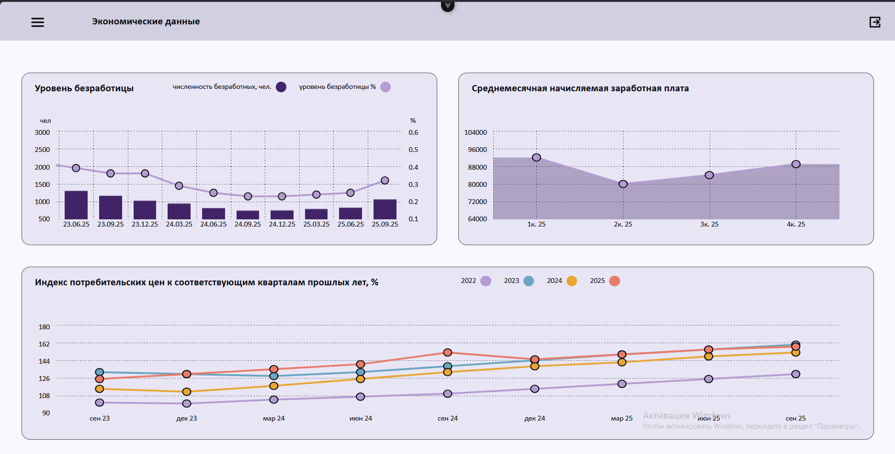
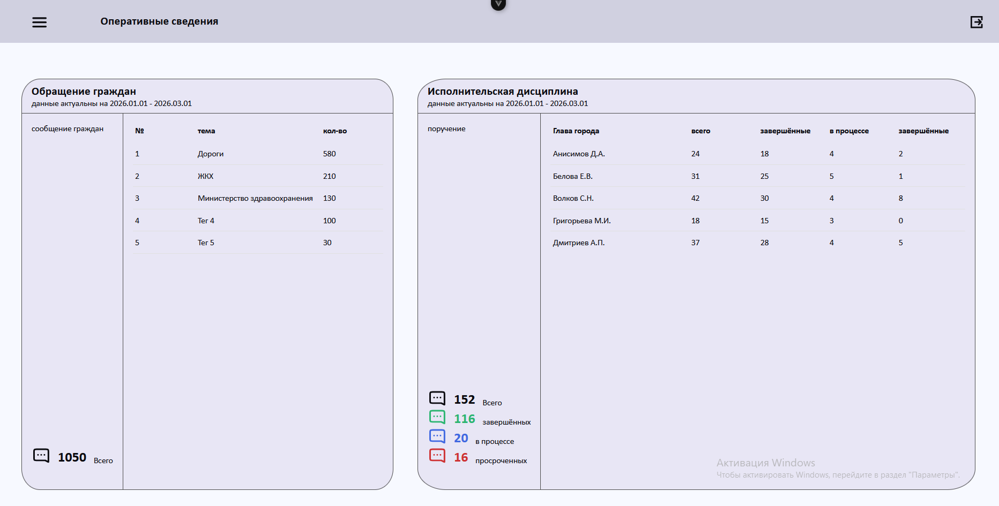
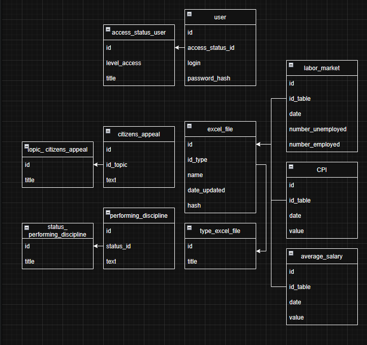

# Dashboard System

Система для визуализации данных в виде интерактивных дашбордов с графиками и метриками.




## Основные возможности

- **Автоматический импорт Excel** — система по расписанию проверяет хэши файлов и загружает новые данные
- **Гибкое расписание** — настройка интервала в днях и точного времени запуска (формат `ЧЧ:ММ`)
- **Визуализация данных** — интерактивные диаграммы и графики

## Технологический стек

| Компонент   | Технология                |
|-------------|---------------------------|
| **Backend** | Go + Gin фреймворк        |
| **Frontend**| Vue 3                      |
| **Database**| PostgreSQL                 |
| **Архитектура** | Луковая (Clean Architecture) |


## Структура проекта
```markdown
project-root/
│ 
├── backend/
│ └── src/
│ ├── cmd/api/ # Точка входа (main.go)
│ ├── internal/
│ │ ├── application/ # Бизнес-логика
│ │ │ └── excel/ # Логика импорта Excel
│ │ ├── config/ # модули для загрузки, парсинга и управления конфигурационными параметрами системы
│ │ ├── domain/ # ядро системы: описание базовых сущностей предметной области и интерфейсов репозиториев
│ │ ├── DTO/ # объекты передачи данных (Data Transfer Objects), структуры запросов/ответов и описание SQL-скриптов
│ │ ├── handler # обработчики HTTP-запросов: принимают запросы, валидируют данные и передают их в слой бизнес-логики
│ │ ├── repository/ # слой доступа к данным
│ │ │ ├── postgres/ # конкретная реализация интерфейсов для взаимодействия с СУБД PostgreSQL
│ │ │ └── SQL # SQL-запросы и скрипты для работы с базой данных (выборка, вставка, обновление данных)
│ │ └── router/ # Маршрутизация HTTP-запросов
│ 
├── frontend/
│ └── src/
│ ├── App.vue # Главный компонент
│ ├── router/ # Настройка маршрутизации
│ ├── page/ # Страницы приложения
│ │ └── [name]/
│ │ └── component/ # Компоненты конкретной страницы
│ └── components/ # Переиспользуемые компоненты
│ ├── UI/ # Кнопки, инпуты, базовые элементы
│ ├── icon/ # SVG-иконки
│ └── diagram/ # Модуль диаграмм
│ └── page/
│ └── component/ # Компоненты страниц диаграмм
│ 
```
## Схема базы данных


### Требования

- Go 1.21+
- Node.js 18+
- PostgreSQL 14+


#### 1. Клонирование репозитория

```bash
git clone https://github.com/mitinu/dashboard.git
cd backend
go mod download
go run src/cmd/api/main.go  #запуск backend


cd ../frontend
npm install
npm run dev                 #запуск в режиме разработчика frontend
npm run bild                #билдинг frontend
```
#### изменение пути билдинга frontend 
в файле frontend/vite.config.js
```js
    outDir: '../backend/dist',  
```
               


```.env
# Gin Mode
# debug, release, test
GIN_MODE=           debug

# App Configuration
APP_PORT=           8080

# Server Timeouts (формат: 15s, 30s, 1m, 2m и т.д.)
SERVER_READ_TIMEOUT=    15s
SERVER_WRITE_TIMEOUT=   15s
SERVER_IDLE_TIMEOUT=    60s
SERVER_SHUTDOWN_TIMEOUT=10s

# Excel Files
PATH_EXCEL=         resource/excel
INTERVAL_DAYS_READS=1
CRON_TIME=          08:00           #hh:mm

# Database
DB_HOST=            localhost
DB_PORT=            5432
DB_USER=            postgres
DB_PASSWORD=        1011
DB_NAME=            dashboard
DB_SSL_MODE=        disable

# Superadmin
LOGIN=              root
PASSWORD=           root
TITLESADMININDB =   суперадмин

# Hash
PEPPER=         pizze
# Argon2id
MEMORY=         64  #MB
ITERATIONS=     3
PARALLELISM=    4
SALTLENGTH=     16
KEYLENGTH=      32
```


## Инструкция: Как добавить новый тип таблиц Excel

При появлении нового аналитического отчета или нового формата данных из Excel, процесс интеграции в систему делится на 4 последовательных шага:

### Шаг 1. Подготовка базы данных (Database)
1. **Создайте целевую таблицу** в PostgreSQL, в которую будут складываться распарсенные данные (определите поля, типы данных и внешние ключи).
2. **Зарегистрируйте новый тип файла**: добавьте соответствующую конфигурационную строку в служебную таблицу `type_excel_file`.

### Шаг 2. Реализация слоя данных (Data Layer)
В соответствии с Луковой архитектурой проекта, добавьте структуры и методы для работы с новой таблицей:
* `internal/domain/` — опишите структуру сущности и интерфейс репозитория (методы вроде `Save` или `Get`).
* `internal/DTO/` — создайте структуры для входящих данных (Data Transfer Objects).
* `internal/repository/SQL/` — напишите сырые SQL-скрипты для вставки (`INSERT`), выборки и обновления данных новой таблицы.
* `internal/repository/postgres/` — напишите конкретную реализацию интерфейса репозитория, которая будет выполнять эти SQL-запросы через драйвер БД.

### Шаг 3. Создание логики парсинга (Application Layer)
1. **Чтение файла:** Создайте новый Go-файл в директории `backend/src/internal/application/excel/reading/`. В нем реализуйте логику чтения ячеек с помощью библиотеки `excelize` (валидация строк, маппинг колонок в структуры DTO).
2. **Инициализация сохранения:** Откройте файл `backend/src/internal/application/excel/addTable.go` и добавьте туда функцию-обработчик:
   ```go
   func addTableNameTable(s *ExcelService, excelInfo *DTO.ExcelInfo, path string, name string, hash []byte) {{
       // Вызов парсера из папки reading
       // Передача DTO-структур в слой репозитория для сохранения в БД
   }
   ```
   (Где NameTable — понятное название вашей новой таблицы).

### Шаг 4. Привязка к триггеру автоматического чтения
Чтобы воркер понял, какой именно файл перед ним находится, откройте файл, где реализована функция checkHash (логика сканирования директории):

Найдите массив substrings (коллекция ключевых слов, по которым система идентифицирует файлы) и добавьте туда уникальную подстроку-маркер для вашего нового Excel-файла.

В управляющую конструкцию switch, которая распределяет файлы по обработчикам, добавьте новый case:
```go
   case strings.Contains(lowerName, "суда подстроку которая будет содержаться в каждом файле этого типа данных"):
        addTableNameTable(s, excelInfo, path, name, hash)
```

## Автоматическое чтение Excel

Система работает по следующему принципу:
    По расписанию (задается через CRON_TIME и INTERVAL_DAYS_READS) запускается задача
    Проверяется хэш Excel-файла по указанному пути PATH_EXCEL
    Если хэш изменился — данные импортируются в PostgreSQL
    Дашборд автоматически отображает актуальные данные

Пример настройки расписания:
Конфигурация	Результат
CRON_TIME=09:00 INTERVAL_DAYS_READS=1	каждый день в 9:00
CRON_TIME=18:30 INTERVAL_DAYS_READS=2	каждые 2 дня в 18:30


## Режимы работы Gin

| Режим | Описание |
|-------|----------|
| `debug` | Подробные логи, hot-reload (для разработки) |
| `release` | Оптимизированный режим (для продакшена) |
| `test` | Режим для интеграционных тестов |

---

## Частые проблемы и решения

| Проблема | Решение |
|----------|---------|
| Порт 8080 уже занят | Измените `APP_PORT` в `.env` на другой, например 8081 |
| Не удается подключиться к БД | Проверьте что PostgreSQL запущен: `sudo systemctl start postgresql` |
| Excel файл не читается | Убедитесь что путь `PATH_EXCEL` существует и файл имеет права на чтение |


